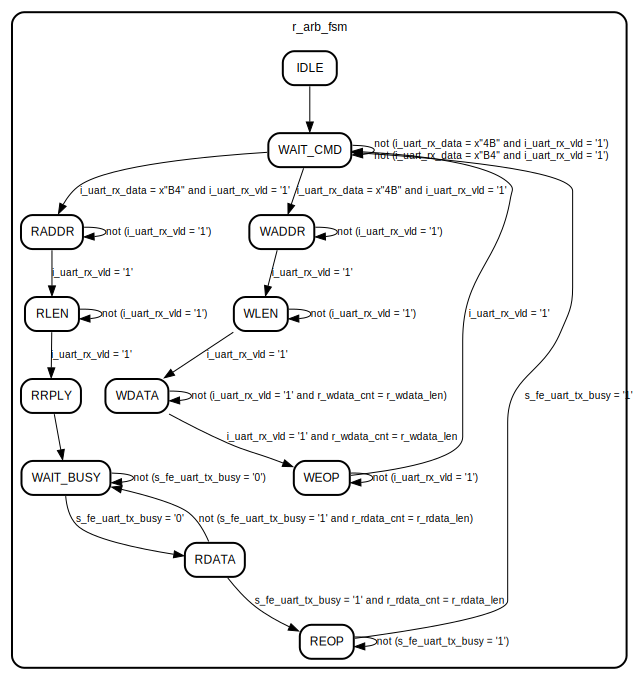

# Entity: arbiter 
- **File**: arbiter.vhd

## Diagram

## Ports

| Port name      | Direction | Type                         | Description                            |
| -------------- | --------- | ---------------------------- | -------------------------------------- |
| i_clk          | in        | std_logic                    | Clock signal                           |
| i_rst          | in        | std_logic                    | Reset signal, active high              |
| o_addr         | out       | std_logic_vector(7 downto 0) | Output address bus                     |
| o_we           | out       | std_logic                    | Output write enable signal             |
| o_wdata        | out       | std_logic_vector(7 downto 0) | Output write data bus                  |
| i_rdata        | in        | std_logic_vector(7 downto 0) | Input read data bus                    |
| i_uart_rx_data | in        | std_logic_vector(7 downto 0) | Input UART received data bus           |
| i_uart_rx_vld  | in        | std_logic                    | Input UART received data valid signal  |
| o_uart_tx_data | out       | std_logic_vector(7 downto 0) | Output UART transmit data bus          |
| o_uart_tx_vld  | out       | std_logic                    | Output UART transmit data valid signal |
| i_uart_tx_busy | in        | std_logic                    | Input UART transmit busy signal        |

## Signals

| Name              | Type                 | Description                                            |
| ----------------- | -------------------- | ------------------------------------------------------ |
| s_arb_fsm         | t_arb_fsm            | Writing data to memory                                 |
| r_arb_fsm         | t_arb_fsm            | Writing data to memory                                 |
| s_wdata_cnt       | unsigned(7 downto 0) | Counter for number of bytes written                    |
| r_wdata_cnt       | unsigned(7 downto 0) | Register Counter for number of bytes written           |
| r_wdata_len       | unsigned(7 downto 0) | Register for number of bytes to write                  |
| s_wdata_len       | unsigned(7 downto 0) | Counter for number of bytes to write                   |
| r_rdata_cnt       | unsigned(7 downto 0) | Register Counter for number of bytes read              |
| s_rdata_cnt       | unsigned(7 downto 0) | Counter for number of bytes read                       |
| r_rdata_len       | unsigned(7 downto 0) | Register for number of bytes to read                   |
| s_rdata_len       | unsigned(7 downto 0) | Counter for number of bytes to read                    |
| r_uart_tx_busy    | std_logic            | Register for UART transmit busy signal                 |
| s_fe_uart_tx_busy | std_logic            | Signal for edge detection of UART transmit busy signal |
| s_addr            | unsigned(7 downto 0) | Signal for output address bus                          |
| r_addr            | unsigned(7 downto 0) | Signal for output address bus                          |
| s_we              | std_logic            | Signal for output write enable                         |

## Enums

### *t_arb_fsm*
| Name      | Description                                |
| --------- | ------------------------------------------ |
| IDLE      | Idle state, waiting for UART data          |
| WAIT_CMD  | Waiting for command from UART              |
| WADDR     | Writing address to memory                  |
| WLEN      | Setting write enable signal                |
| WDATA     | Writing data to memory                     |
| WEOP      | Ending write operation                     |
| RADDR     | Writing address to memory                  |
| RLEN      | Setting read enable signal                 |
| RRPLY     | Replying with read data to UART            |
| RDATA     | Reading data from memory                   |
| WAIT_BUSY | Waiting for UART to be ready for next byte |
| REOP      | Ending read operation                      |

## Processes
- p_uart_tx_busy: ( i_clk, i_rst )
- p_arb_fsm_sync: ( i_clk, i_rst )
- p_arb_fsm: ( r_arb_fsm, i_uart_rx_vld, i_uart_rx_data, i_rdata, i_uart_tx_busy, r_wdata_cnt, r_wdata_len, r_rdata_cnt, r_rdata_len )
- p_arb_fsm_mux: ( r_arb_fsm, i_uart_rx_vld, i_uart_rx_data, i_rdata, i_uart_tx_busy, r_wdata_cnt, r_wdata_len,
                            r_rdata_cnt, r_rdata_len, r_addr )
- p_arb_fsm_output: ( i_clk, i_rst )

## State machines

