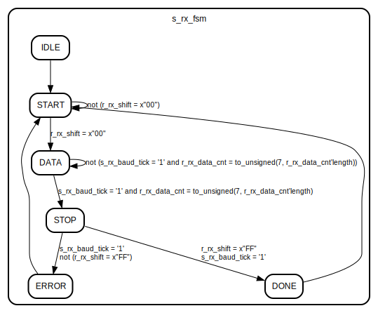
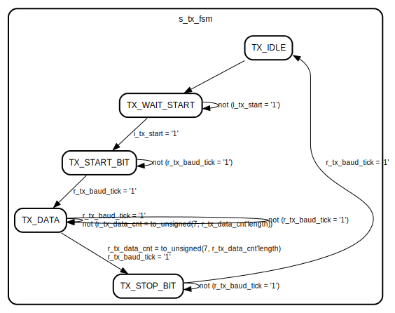

# Entity: uart 
- **File**: uart.vhd

## Diagram

## Generics

| Generic name | Type    | Value      | Description                       |
| ------------ | ------- | ---------- | --------------------------------- |
| g_CLK_FREQ   | integer | 30_000_000 | Define clock frequency 30 MHz     |
| g_BAUD_RATE  | integer | 1_000_000  | BAUDRATE of UART protocole 1 Mbps |

## Ports

| Port name  | Direction | Type                         | Description                                                                                                                                                             |
| ---------- | --------- | ---------------------------- | ----------------------------------------------------------------------------------------------------------------------------------------------------------------------- |
| i_clk      | in        | std_logic                    | Clock input for synchronizing the UART operations, used to generate baud ticks and drive the FSMs for both receiving and transmitting data                              |
| i_rst      | in        | std_logic                    | Reset signal for initializing the UART state machines and counters, active high                                                                                         |
| i_rx       | in        | std_logic                    | Serial input for receiving data, connected to the RX line of the UART interface, used to sample incoming data bits for reception                                        |
| o_tx       | out       | std_logic                    | Serial output for transmitting data, connected to the TX line of the UART interface, driven low for start bit, then shifted out data bits, and driven high for stop bit |
| o_rx_data  | out       | std_logic_vector(7 downto 0) | Output for the received data byte, driven with the received data bits once a full byte has been received and validated                                                  |
| o_rx_vld   | out       | std_logic                    | Signal to indicate that the received data byte is valid and can be read from o_rx_data, set when a full byte has been received and validated                            |
| i_tx_data  | in        | std_logic_vector(7 downto 0) | Input for the data byte to be transmitted, loaded into the transmit shift register when a transmission is initiated                                                     |
| i_tx_start | in        | std_logic                    | Signal to start transmission of the data byte on i_tx_data, when asserted, the UART will begin transmitting the start bit followed by the data bits and stop bit        |
| o_tx_busy  | out       | std_logic                    | Signal to indicate that a transmission is in progress, used to prevent new transmissions from starting until the current one is complete                                |

## Signals

| Name            | Type                         | Description                                                                                                                                     |
| --------------- | ---------------------------- | ----------------------------------------------------------------------------------------------------------------------------------------------- |
| s_rx_baud_tick  | std_logic                    | Baud tick signal for receiving data, generated when r_rx_baud_cnt reaches c_BAUD_TICK_CNT_HALF                                                  |
| r_rx_baud_cnt   | unsigned(31 downto 0)        | Counter for generating baud tick for receiving data                                                                                             |
| r_rx_shift      | std_logic_vector(7 downto 0) | Shift register for receiving data bits                                                                                                          |
| s_rx_data_cnt   | unsigned(2 downto 0)         | Count received data bits                                                                                                                        |
| r_rx_data_cnt   | unsigned(2 downto 0)         | Registered Count received data bits                                                                                                             |
| s_rx_data_store | std_logic_vector(7 downto 0) | Register to store received data bits before output                                                                                              |
| r_rx_data_store | std_logic_vector(7 downto 0) | Register to store received data bits before output                                                                                              |
| s_rx_vld        | std_logic                    | Signal to indicate that received data is valid and can be output, set when a full byte has been received and validated                          |
| r_rx_vld        | std_logic                    | Signal to indicate that received data is valid and can be output, set when a full byte has been received and validated                          |
| s_rx_start_bit  | std_logic                    | Signal to indicate that a start bit has been detected, used to trigger the reception process                                                    |
| s_rx_fsm        | t_rx_fsm                     | FSM state for receiving data, r_rx_fsm is the internal state, s_rx_fsm is the synchronized state for output                                     |
| r_rx_fsm        | t_rx_fsm                     | FSM state for receiving data, r_rx_fsm is the internal state, s_rx_fsm is the synchronized state for output                                     |
| r_tx_baud_tick  | std_logic                    | Baud tick signal for transmit data, generated when r_rx_baud_cnt reaches c_BAUD_TICK_CNT_HALF                                                   |
| r_tx_baud_cnt   | unsigned(31 downto 0)        | Counter for generating baud tick for transmit data                                                                                              |
| s_tx_data_cnt   | unsigned(2 downto 0)         | Counter for received data bits, used to track how many bits have been received during the DATA state of the receive FSM                         |
| r_tx_data_cnt   | unsigned(2 downto 0)         | Counter for received data bits, used to track how many bits have been received during the DATA state of the receive FSM                         |
| s_tx_data_store | std_logic_vector(7 downto 0) | Register to store data bits to be transmitted, loaded with i_tx_data when transmission starts                                                   |
| r_tx_data_store | std_logic_vector(7 downto 0) | Register to store data bits to be transmitted, loaded with i_tx_data when transmission starts                                                   |
| s_tx            | std_logic                    | Output signal for transmitting data, driven low for start bit, then shifted out data bits, and driven high for stop bit                         |
| r_tx            | std_logic                    | Output signal for transmitting data, driven low for start bit, then shifted out data bits, and driven high for stop bit                         |
| s_tx_busy       | std_logic                    | Signal to indicate that transmission is in progress, used to prevent new transmissions from starting until the current one is complete          |
| r_tx_busy       | std_logic                    | Register Signal to indicate that transmission is in progress, used to prevent new transmissions from starting until the current one is complete |
| s_tx_fsm        | t_tx_fsm                     | Transmitting stop bit                                                                                                                           |
| r_tx_fsm        | t_tx_fsm                     | Transmitting stop bit                                                                                                                           |

## Constants

| Name                 | Type                  | Value                                                                                   | Description                                                                                                                                        |
| -------------------- | --------------------- | --------------------------------------------------------------------------------------- | -------------------------------------------------------------------------------------------------------------------------------------------------- |
| c_BAUD_TICK_CNT      | unsigned(31 downto 0) | to_unsigned((g_CLK_FREQ / g_BAUD_RATE),  32)         | Number of clock cycles per baud tick, used for timing the reception of bits                                                                        |
| c_BAUD_TICK_CNT_HALF | unsigned(31 downto 0) | to_unsigned(((g_CLK_FREQ / g_BAUD_RATE) / 2)+7,  32) | Number of clock cycles for half a baud tick, used for sampling the middle of the bit period, adjusted by 7 cycles to account for processing delays |

## Enums

### *t_rx_fsm*
| Name  | Description                                                 |
| ----- | ----------------------------------------------------------- |
| IDLE  | RESET state, waiting for start bit                          |
| START | Start bit detected, waiting for data bits                   |
| DATA  | Receiving data bits                                         |
| STOP  | Stop bit, validating received data                          |
| DONE  | Data reception complete, output data and wait for next byte |
| ERROR |                                                             |

### *t_tx_fsm*
| Name          | Description                                                        |
| ------------- | ------------------------------------------------------------------ |
| TX_IDLE       | Waiting for transmit start signal                                  |
| TX_WAIT_START | Start signal received, waiting for baud tick to start transmission |
| TX_START_BIT  | Transmitting start bit                                             |
| TX_DATA       | Transmitting data bits                                             |
| TX_STOP_BIT   |                                                                    |

## Processes
- p_rx_shift: ( i_clk, i_rst )
- p_rx_baud_cnt: ( i_clk, i_rst )
- p_rx_fsm_sync: ( i_clk, i_rst )
- p_rx_fsm: ( r_rx_fsm, s_rx_baud_tick, r_rx_shift, r_rx_data_cnt )
- p_rx_fsm_mux: ( r_rx_shift, r_rx_fsm, s_rx_baud_tick, r_rx_data_cnt )
- p_rx_fsm_output: ( i_clk, i_rst )
- p_tx_baud_cnt: ( i_clk, i_rst )
- p_tx_fsm_sync: ( i_clk, i_rst )
- p_tx_fsm: ( r_tx_fsm, r_tx_baud_tick, i_tx_start, r_tx_data_cnt )
- p_tx_fsm_mux: ( r_tx_fsm, r_tx_baud_tick, i_tx_start, i_tx_data, r_tx_data_cnt, r_tx_data_store )
- p_tx_fsm_output: ( i_clk, i_rst )

## State machines

